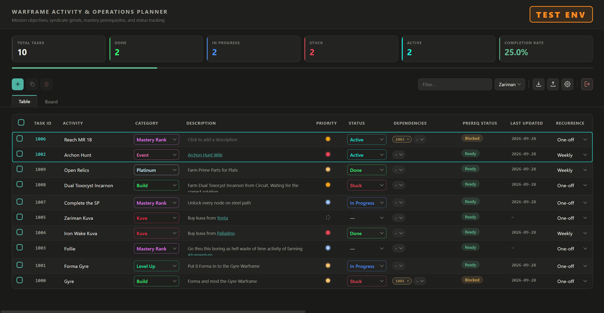
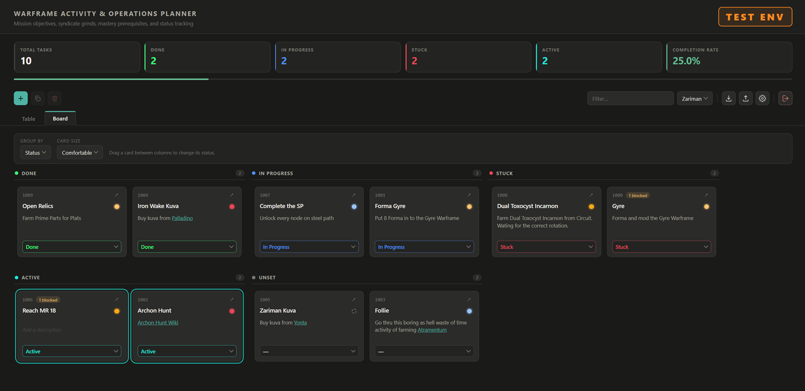
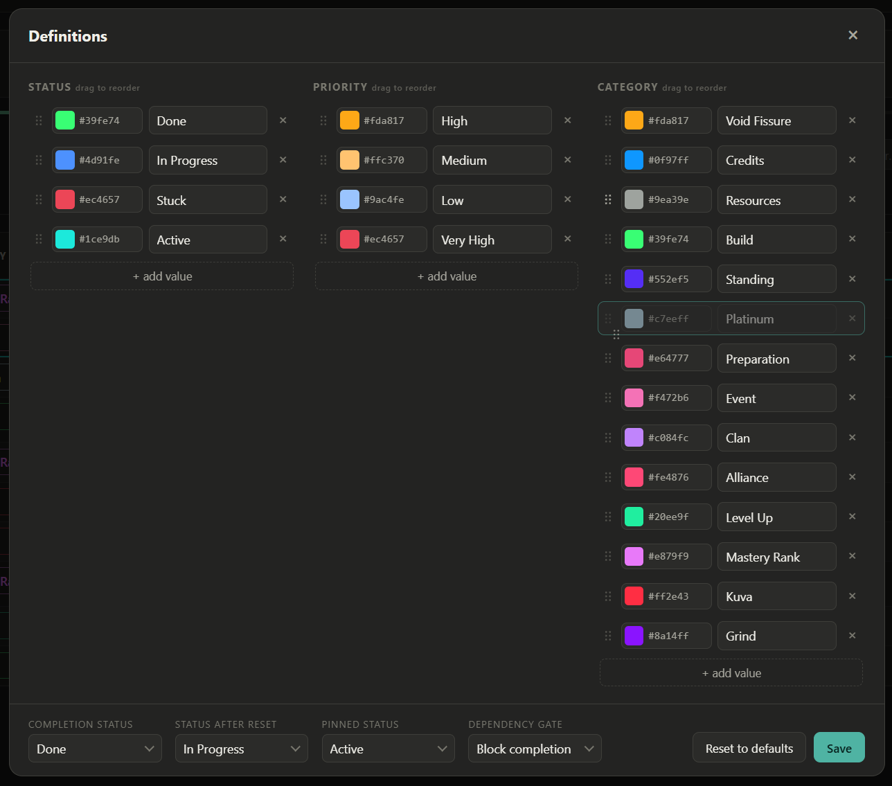

# Warframe Planner

Track the activities you set yourself in Warframe — farms, grinds, prime sets,
syndicate standing, weekly resets — in one local planner that stays on your PC.

[](https://github.com/soswi/WarframePlanner/releases/tag/v0.2.0)
[](LICENSE)

<!--
  SCREENSHOT: docs/screenshots/table.png
  The table view, Zariman theme, window about 1600px wide. Take it in
  --run-test-env so none of your own data shows.
  Around 8-10 tasks with believable names (a prime set, a relic farm, Archon Hunt,
  Netracells, a mastery item). Include: one or two Active rows at the top so the
  pinned frame is visible, a mix of Done / In Progress / Stuck, several priority
  dots in different colours, one task with two dependency chips and a Blocked
  prereq status. The KPI row and progress bar must be in frame.
-->


## Highlights

- **Your activities, your words.** Statuses, priorities and categories are yours
  to name, colour and reorder.
- **Two views of the same list.** A sortable table for editing, a board of
  cards grouped however you like for an overview.
- **Dependencies that mean something.** A task can wait on several others, and
  cannot be marked done while any of them is still open.
- **Weekly and daily resets.** Recurring tasks return to *In Progress* on their
  own at 01:00 UTC, matching the game's reset.
- **Private by design.** Everything is stored on your machine. No account, no
  cloud, no network calls.

## Download

Get `WarframePlanner-<version>.exe` from the
[Releases page](https://github.com/soswi/WarframePlanner/releases) and run it.
Your browser opens the planner. There is nothing to install.

The executable is not code-signed, so Windows SmartScreen warns on first launch.
Choose **More info → Run anyway**.

Running it again while it is already open brings you back to the same window
rather than starting a second copy. Closing the browser tab leaves the planner
running in the background; the red button at the right of the toolbar shuts it
down.

### Try it without touching your data

```
WarframePlanner-<version>.exe --run-test-env
```

Opens the planner on a fresh, empty database so you can see what a first launch
looks like. The header shows a large **TEST ENV** marker. Quitting with the red
button deletes the test data; your own planner is never opened.

## Using it

### Tasks

Add a task with **+** and it lands at the top of the list. Click any field to
edit it. Descriptions accept Markdown — lists, bold, links, code — and expand on
hover when they do not fit.

Scrolling the mouse wheel over a status or priority steps through its values.
The list waits a second before reordering, so a row does not jump away from
under your cursor.

The status you choose as **pinned** (Active by default) always sits at the top,
framed in its own colour, whatever the list is sorted by.

### The board

<!--
  SCREENSHOT: docs/screenshots/board.png
  Board tab, grouped by Status, card size Comfortable, Zariman theme.
  Show at least three filled groups of different sizes so the square packing is
  visible (e.g. 5, 4 and 2 cards), plus one empty group with its dashed Add
  button. At least one card should be Active so its ring shows. Hover nothing.
-->


Group cards by status, priority, category or recurrence. Dragging a card into
another group changes that field. Card size sets how dense the board is. The
arrow on a card jumps to the same task in the table.

### Dependencies

Add prerequisites from the Dependencies column. The Prereq Status column then
tells you whether a task is **Ready** or **Blocked**, and hovering it lists what
it is waiting on. Marking a blocked task done is refused with the names of the
tasks in the way; you can switch this off under Definitions.

### Completion rate

Only tasks that have a status count towards it. A task with no status has not
been sorted yet, so it is left out rather than dragging the rate down:

```
completion rate = tasks with the completion status / tasks with any status
```

With 5 tasks — 2 Done, 1 In Progress, 2 without a status — the rate is
2 / 3 = 67%, not 2 / 5 = 40%. **Total tasks** still counts all five.

### Recurring tasks

Set a task's recurrence to **Daily** or **Weekly**. At 01:00 UTC (Mondays for
weekly) it returns to *In Progress*. If the planner was closed across a reset,
it catches up once on the next launch.

## Make it yours

<!--
  SCREENSHOT: docs/screenshots/definitions.png
  Definitions dialog open over the table. Show all three columns (Status,
  Priority, Category) with the colour swatches and hex fields, the drag grips,
  and the Reset to defaults and Save buttons in the footer. If possible, catch
  one row mid-drag.
-->


Open **Definitions** (the gear icon) to rename, recolour, add, remove or reorder
statuses, priorities and categories. **Reset to defaults** brings back the
shipped set.

Nothing about the vocabulary is tied to Warframe. Rename the categories and you
have a planner for another game, or for something else entirely.

Five colour themes live in the toolbar: Zariman, Orokin, Corpus, Grineer and
Infested.

### Sharing a setup

Export writes your whole planner to a JSON file, and Import reads one back.
That makes a setup easy to share or reuse:

1. Start with `--run-test-env`, so you begin from a clean slate.
2. Set up your definitions and settings, adding any template tasks you want to
   hand over.
3. Export. The file contains only what you built there, none of your own tasks.

On import you choose between two modes:

- **Merge** keeps what you have. A task matching by id or by name is updated in
  place, anything new is added, and the file's definitions replace yours.
- **Replace** discards everything and makes the file the whole planner,
  settings included.

## Your data

Everything is in a single file:

| System | Location |
|---|---|
| Windows | `%APPDATA%\WarframePlanner\planner.db` |
| macOS | `~/Library/Application Support/WarframePlanner/planner.db` |
| Linux | `~/.local/share/WarframePlanner/planner.db` |

It survives updating the executable. To back up, copy that file or use Export.

Updates can change the storage format and do so in one direction only, so an
older version cannot open a database a newer one has upgraded. Keep a backup
before moving to a new release.

## Build from source

Requires Python 3.11 or newer.

```powershell
python -m venv .venv
.\.venv\Scripts\Activate.ps1
pip install -r requirements.txt
python main.py
```

To produce the executable:

```powershell
pip install -r requirements-build.txt
pyinstaller WarframePlanner.spec
```

The result is `dist\WarframePlanner-<version>.exe`. PyInstaller only builds for
the system it runs on.

## Contributing

Issues and pull requests are welcome. [CONTRIBUTING.md](CONTRIBUTING.md) covers
the code layout, how to extend it, and how releases are cut.

## Licence

MIT; see [LICENSE](LICENSE). Third-party components, including two interface
patterns adapted from Uiverse, are listed in
[THIRD-PARTY-NOTICES.md](THIRD-PARTY-NOTICES.md).

Warframe is a trademark of Digital Extremes Ltd. This is an unofficial fan-made
tool, not affiliated with or endorsed by Digital Extremes.
